# Az Infra Harness

[](https://www.npmjs.com/package/@zureltd/az-infra-harness)

An interactive planning tool that guides you through designing Azure infrastructure and then generates production-ready Bicep or Terraform code from your decisions.

You interact with a coding agent (Claude Code, OpenCode, or GitHub Copilot) using slash commands. The agent asks you questions, captures your answers, and writes structured files that appear in a read-only Next.js UI. Once your planning is complete, a final command generates the IaC.

Setting the right context by answering guided questions improves the quality of code that is being generated. In the 5 steps the `az infra harness` uses it collects all context of your application. from a functional level to security & availability and it 

---

## How It Works

### The workflow has 5 phases:

```
1. Application Definition   →   What are you building?
2. Context                  →   What infrastructure exists already?
3. Application Architecture →   How should it be deployed?
4. Architecture Decisions   →   What trade-offs did you make and why?
5. Code Generation          →   Generate Bicep or Terraform
```

Each phase is driven by **slash commands** you run in your coding agent. The agent follows detailed skill definitions (in `skills/`) that guide the conversation, validate your answers, and write the output files.

The UI (`npx @zureltd/az-infra-harness`) displays what the agent has written. Each card shows a blue border and checkmark when its data file exists. You never edit files manually — the agent does it.

### Supported agents

| Agent | Command directory |
|-------|------------------|
| [Claude Code](https://claude.ai/code) | `.claude/commands/` |
| [OpenCode](https://opencode.ai) | `.opencode/commands/` |
| [GitHub Copilot](https://github.com/features/copilot) | `.github/prompts/` |

---

## Walkthrough

The following screenshots show how Az Infra Harness looks when working through the [eShop on Containers](https://github.com/dotnet/eShop) reference application — a microservices-based e-commerce app by Microsoft.

### Phase 1 — Application Definition

Start with an empty planning board. All cards are grey, waiting for data.

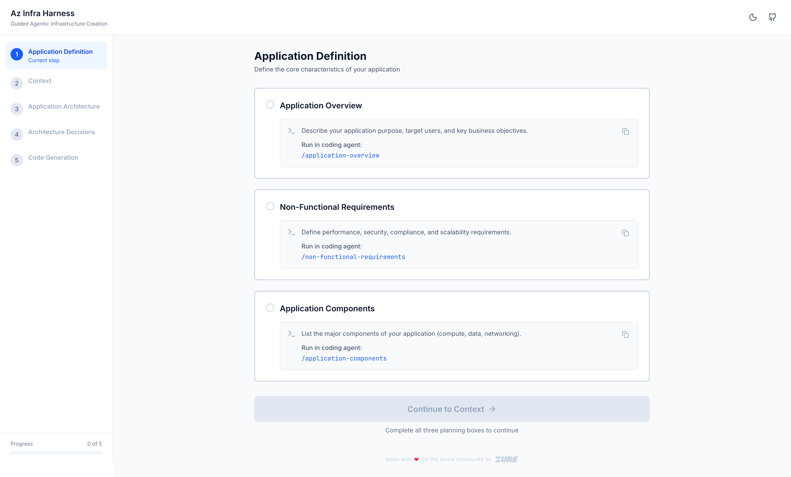

After running `/application-overview`, `/non-functional-requirements`, and `/application-components`, each card turns blue with a checkmark. The sidebar tracks overall progress.

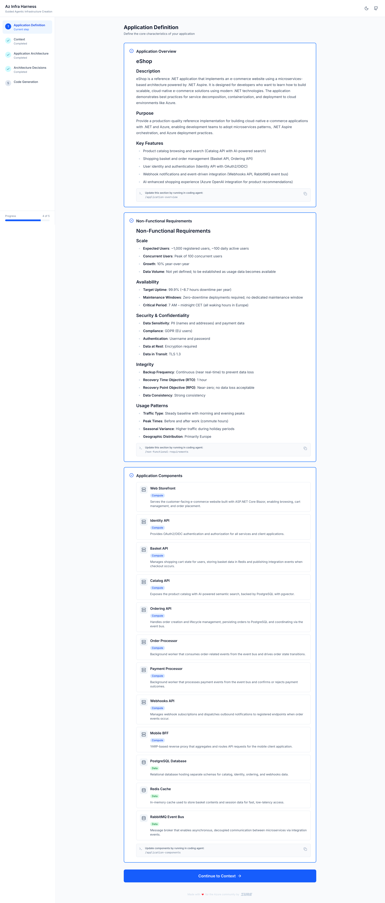

---

### Phase 2 — Context

Move on to describe your existing infrastructure, platform services, and development workflow.

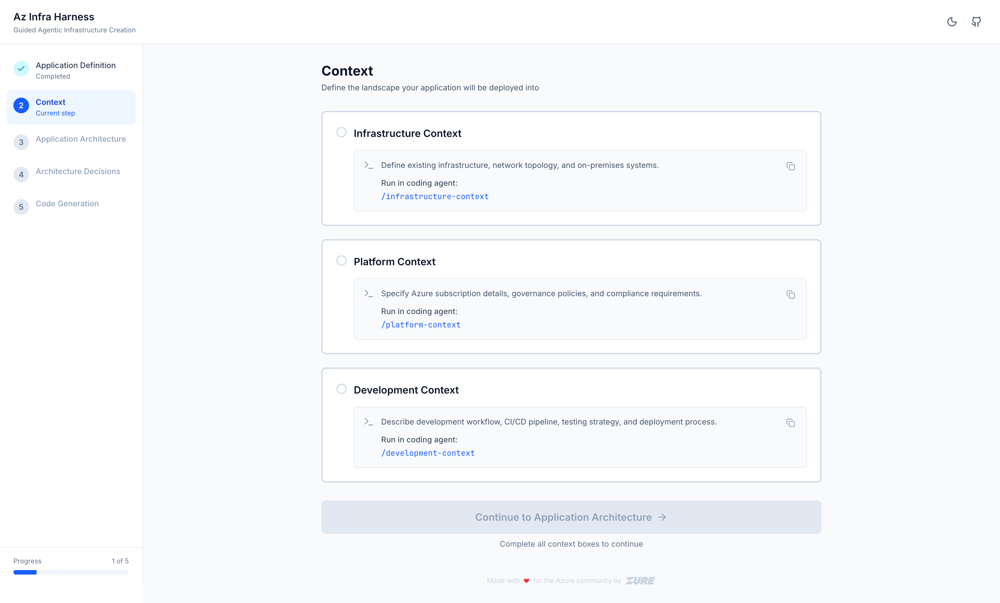

After running `/infrastructure-context`, `/platform-context`, and `/development-context`, all three cards complete.

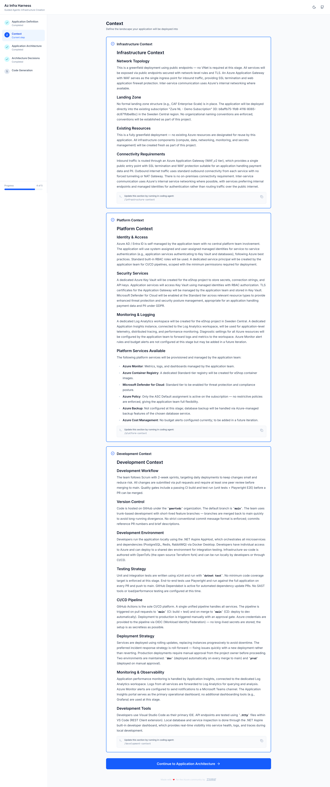

---

### Phase 3 — Application Architecture

Map your components to Azure services and generate an architecture diagram.

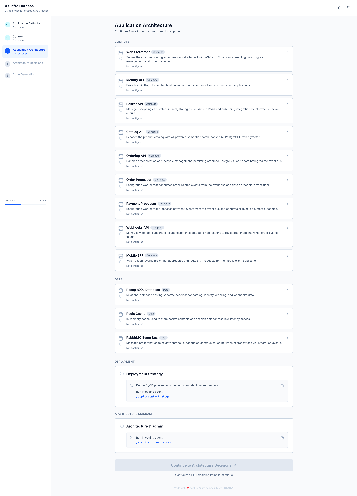

After running `/configure-component`, `/deployment-strategy`, and `/architecture-diagram`, the architecture diagram renders and all component cards are filled in.

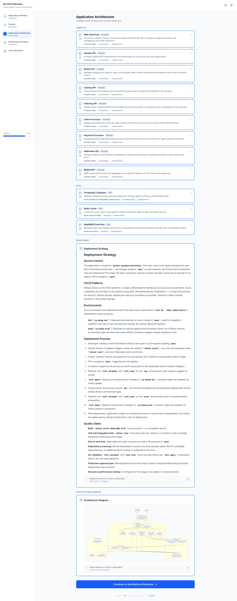

Each component card can be expanded to see the full Azure service configuration — service, SKU, region, and settings.

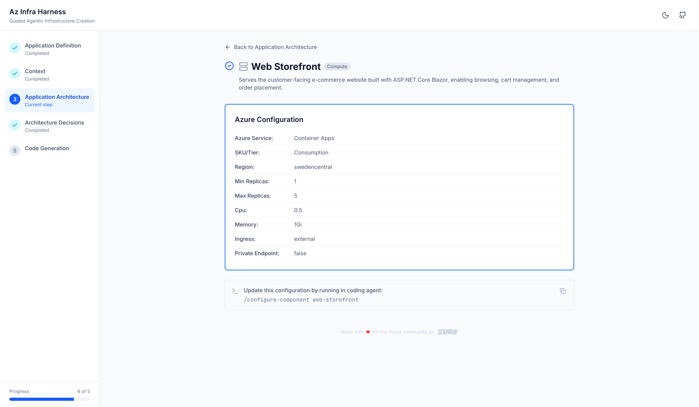

---

### Phase 4 — Architecture Decisions

Document the trade-offs you made using Architecture Decision Records (ADRs).

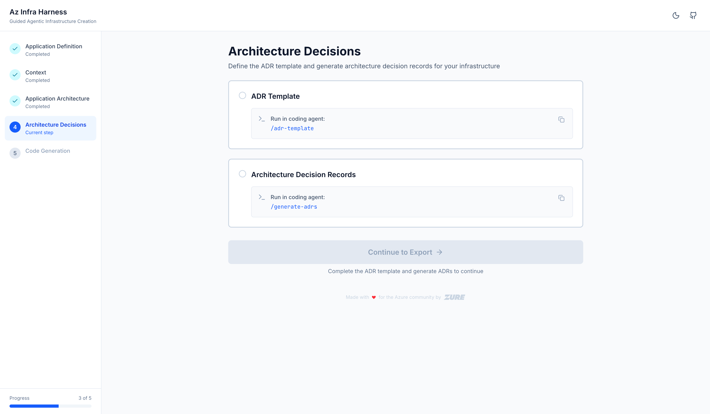

After running `/generate-adrs`, the agent proposes and creates ADRs for each significant decision.

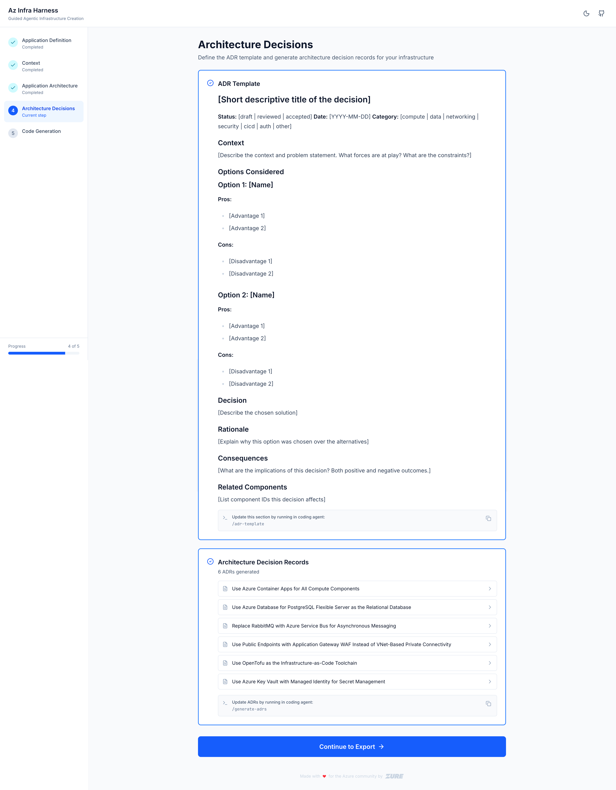

Each ADR can be opened to read the full context, decision rationale, alternatives considered, and consequences.

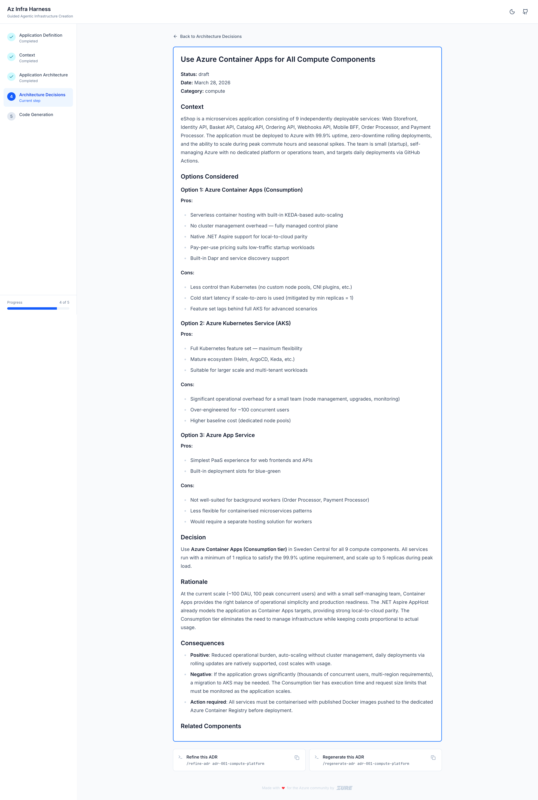

---

### Phase 5 — Code Generation

Generate production-ready Bicep or Terraform from everything captured so far.

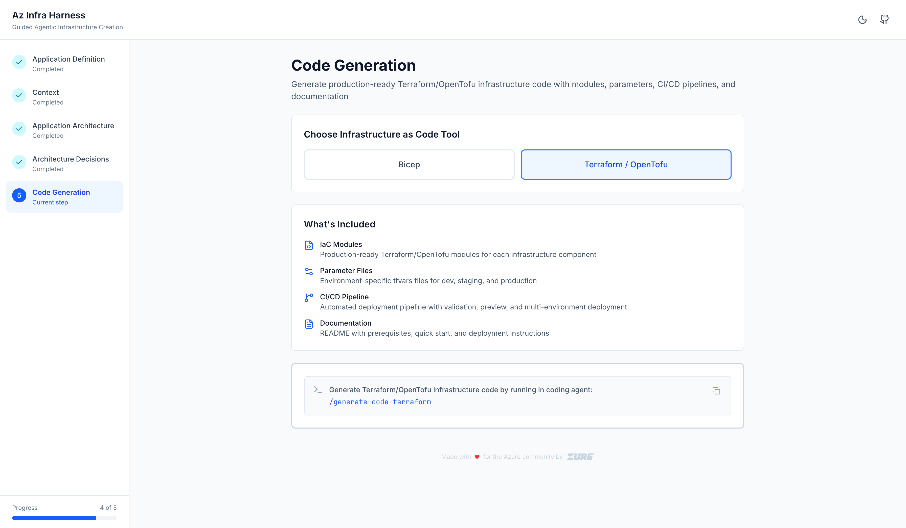

After running `/generate-code-terraform` (or `/generate-code-bicep`), the agent creates a complete IaC module structure — root files, per-component modules, parameter files, and a CI/CD pipeline — all available as a downloadable ZIP.

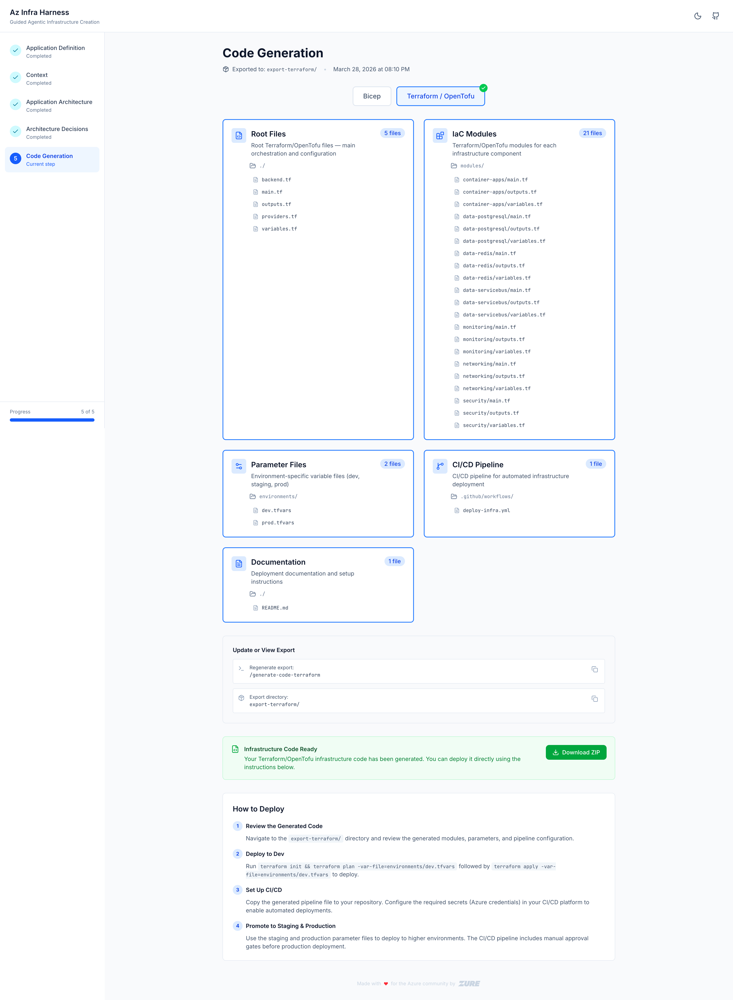

---

## Getting Started

## Quick Start (via npx)

The fastest way to get started — no cloning required:

```bash
# Start the planning UI in your project directory
npx @zureltd/az-infra-harness

# With a custom port
npx @zureltd/az-infra-harness --port 8080

# Read/write data from a specific directory
npx @zureltd/az-infra-harness --data-dir ./my-azure-plan
```

Then open [http://localhost:3000](http://localhost:3000).

To add coding agent slash commands to your project:

```bash
# Install commands for Claude Code
npx @zureltd/az-infra-harness init --agent claude

# Install commands for OpenCode
npx @zureltd/az-infra-harness init --agent opencode

# Install commands for GitHub Copilot
npx @zureltd/az-infra-harness init --agent copilot
```

The UI reads planning files from `./infra/` (including generated `infra/bicep/` and `infra/tf/` subdirectories) relative to where you run the command.

---

## Getting Started (from source)

### Prerequisites

- Node.js 18+
- A supported coding agent (Claude Code recommended)

### 1. Clone and install

```bash
git clone https://github.com/zure/az-infra-harness
cd az-infra-harness/src
npm install
```

### 2. Start the UI

```bash
cd src
npx @zureltd/az-infra-harness
```

Open [http://localhost:3000](http://localhost:3000). You'll see the empty planning board — all cards grey, waiting for data.

### 3. Open your coding agent in the project root

For Claude Code:
```bash
claude
```

### 4. Run the planning commands

Work through the phases in order:

**Phase 1 — Application Definition**
```
/application-overview
/non-functional-requirements
/application-components
```

**Phase 2 — Context**
```
/infrastructure-context
/platform-context
/development-context
```

**Phase 3 — Application Architecture**
```
/configure-component        # run once per component
/deployment-strategy
/architecture-diagram
```

**Phase 4 — Architecture Decisions**
```
/adr-template
/generate-adrs
/refine-adr                 # optional, to update status or add detail
```

**Phase 5 — Code Generation**
```
/generate-code-bicep
```
or
```
/generate-code-terraform
```

After each command, refresh your browser to see the card update. When all cards in a section are complete, the "Continue to next section" button enables.

---

## Project Structure

```
az-infra-harness/
├── src/                          # Next.js application
│   ├── app/                      # Pages (one per workflow phase)
│   ├── components/               # React components
│   ├── infra/                    # Agent-generated planning files (the "database")
│   │   ├── application-definition/
│   │   ├── context/
│   │   ├── application-architecture/
│   │   │   └── components/       # One JSON file per configured component
│   │   ├── architecture-decisions/
│   │   │   └── adrs/             # One markdown file per ADR
│   │   ├── bicep/                # Generated Bicep IaC (created by /generate-code-bicep)
│   │   └── tf/                   # Generated Terraform IaC (created by /generate-code-terraform)
│   ├── lib/                      # File loaders (read infra/ at request time)
│   └── demo/                     # Demo state scripts (see below)
├── skills/                       # Agent skill definitions (SKILL.md per command)
│   ├── application-definition/
│   ├── context/
│   ├── application-architecture/
│   ├── architecture-decisions/
│   └── code-generation/
├── .claude/commands/             # Claude Code slash command wrappers
├── .opencode/commands/           # OpenCode command wrappers
└── .github/prompts/              # GitHub Copilot prompt files
```

### How the agent writes data

Each slash command reads a `SKILL.md` file from `skills/`. The skill instructs the agent to:

1. Scan the codebase for existing information
2. Ask questions interactively (one section at a time)
3. Validate answers before writing
4. Write a markdown or JSON file into `infra/`
5. Confirm the file location and next step

The UI reads these files at request time — no build step needed, just refresh.

---

## Available Commands

### Application Definition

| Command | Output file | Description |
|---------|-------------|-------------|
| `/application-overview` | `infra/application-definition/application-overview.md` | Application name, description, purpose, 5 key features |
| `/non-functional-requirements` | `infra/application-definition/non-functional-requirements.md` | Scale, availability, security, integrity, usage patterns |
| `/application-components` | `infra/application-definition/application-components.md` | Component list with type (Compute/Data/Networking) and descriptions |

### Context

| Command | Output file | Description |
|---------|-------------|-------------|
| `/infrastructure-context` | `infra/context/infrastructure-context.md` | Network topology, landing zone, existing resources, connectivity |
| `/platform-context` | `infra/context/platform-context.md` | Identity, Key Vault, monitoring, platform services |
| `/development-context` | `infra/context/development-context.md` | Workflow, version control, CI/CD, testing, deployment tools |

### Application Architecture

| Command | Output file | Description |
|---------|-------------|-------------|
| `/configure-component` | `infra/application-architecture/components/{id}.json` | Maps a component to an Azure service with SKU and settings |
| `/deployment-strategy` | `infra/application-architecture/deployment-strategy.md` | Source control, CI/CD, environments, quality gates |
| `/architecture-diagram` | `infra/application-architecture/architecture-diagram.md` | Mermaid network diagram derived from planning data |

### Architecture Decisions

| Command | Output file | Description |
|---------|-------------|-------------|
| `/adr-template` | `infra/architecture-decisions/adr-template.md` | Canonical ADR template for this project |
| `/generate-adrs` | `infra/architecture-decisions/adrs/adr-{NNN}-{slug}.md` | Generates ADRs from planning data (one per decision) |
| `/refine-adr` | Updates existing ADR file | Change status, add alternatives, update consequences |

### Code Generation

| Command | Output directory | Description |
|---------|-----------------|-------------|
| `/generate-code-bicep` | `infra/bicep/` | Production-ready Bicep modules with parameter files |
| `/generate-code-terraform` | `infra/tf/` | Production-ready Terraform modules with tfvars files |

---

## Demo Feature

The project includes a demo system for quickly cycling through pre-built planning states. This is useful for presentations, testing the UI, or exploring what a completed workflow looks like.

### Running demo states

From the project root:

```bash
cd src/demo

./0.sh   # Empty — shows the planning board with no data
./1.sh   # Application Definition complete
./2.sh   # + Context complete
./3.sh   # + Application Architecture complete
./4.sh   # + Architecture Decisions complete (ready to export)
./5.sh   # Fully complete — includes export configurations
```

After running a script, **refresh your browser** to see the updated state.

### What each state shows

| State | What you see in the UI |
|-------|----------------------|
| `0.sh` | All cards grey — the starting point for a new project |
| `1.sh` | Application Definition section complete (blue cards with checkmarks) |
| `2.sh` | Application Definition + Context complete |
| `3.sh` | Architecture section added — Mermaid diagram visible, component JSON cards populated |
| `4.sh` | ADR cards appear — 6 example architecture decisions |
| `5.sh` | Full workflow including export data |

### How the demo system works

- All demo data lives in `src/demo/data-backup/` — a snapshot of a complete "Customer Portal" example application
- Each script starts by running `0.sh` (wipe all data), then selectively copies data back up to the chosen state
- Scripts are idempotent — safe to run multiple times
- The demo does not affect the skills, commands, or UI code — only the `infra/` files

### Resetting after a demo

To go back to your own data, run `./0.sh` to wipe the demo data, then re-run your planning commands — or restore from your own backup.

---

## Testing

```bash
cd src
npm test           # Run tests with Vitest
npm run test:ui    # Run tests with Vitest UI
```

Tests live in `src/` alongside the components they test. The test suite covers data loaders and component rendering.

---

## Adding Support for a New Agent

1. Add a command wrapper in the agent's directory (e.g., `.claude/commands/my-command.md`)
2. The wrapper should reference the shared skill: `Read the skill definition at skills/.../SKILL.md and follow its instructions.`
3. The `skills/` directory contains the actual logic — shared across all agents

See `.claude/commands/infrastructure-context.md` for a minimal example.

---

## Key Reference Files

| File | Purpose |
|------|---------|
| `CLAUDE.md` | Project instructions for Claude Code |
| `AGENTS.md` | Agent workflow guide and conventions |
| `DATA-STRUCTURE.md` | File formats and output locations |
| `skills/README.md` | Status table for all skills |
| `.opencode/skills/_shared/interaction-validation-standard.md` | Interaction rules all skills must follow |
