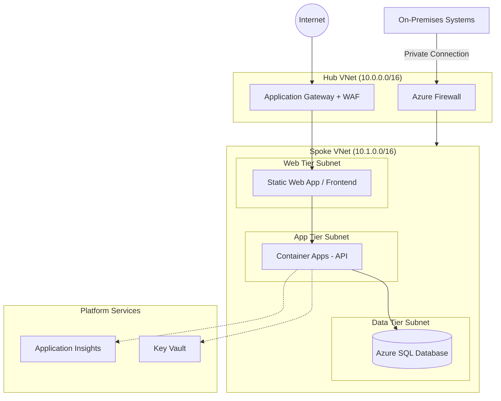

## Purpose

This skill generates a Mermaid `graph TB` diagram that visualizes the application architecture, including network topology and component relationships. It generates `infra/application-architecture/architecture-diagram.md`.

Unlike other skills, this one primarily **derives** the diagram from existing planning data rather than asking many questions. The goal is to produce a useful diagram with minimal interaction.

The generated file will be displayed in the UI when the user runs `npx @zureltd/az-infra-harness` and navigates to the Application Architecture section.

## When to Use

Run this skill when:
- Application components have been defined (via `/application-components`)
- Infrastructure context has been captured (via `/infrastructure-context`)
- User explicitly runs `/architecture-diagram`

## Workflow

### Step 1: Read Existing Planning Data

Read all available planning data to derive the diagram. Gather from:

1. **`infra/application-definition/application-components.md`** — component names and types
2. **`infra/application-architecture/components/*.json`** — Azure services for each component
3. **`infra/context/infrastructure-context.md`** — network topology (hub VNet, spoke VNet, subnets)
4. **`infra/context/platform-context.md`** — shared services (Key Vault, Log Analytics, Container Registry)

If `application-components.md` doesn't exist, stop:
```
I need application components to generate a diagram. Please run /application-components first.
```

---

### Step 2: Check for Existing Diagram

Check whether `infra/application-architecture/architecture-diagram.md` already exists.

**If existing diagram found:**
```
I found an existing architecture diagram. Would you like to:
1. Regenerate it based on your current planning data (overwrites existing)
2. Update it manually (I'll show you the current diagram and ask what to change)
3. Keep the existing diagram as-is
```

Wait for the user's choice.

---

### Step 3: Derive Diagram Structure

Analyze the planning data and build a mental model of the diagram:

**Network layers to represent (based on infrastructure-context.md):**
- External internet (user traffic source)
- Hub VNet (if hub-spoke topology) — with Firewall, Application Gateway/Front Door
- Spoke VNet — with subnets per tier (web, app, data)
- On-premises (if applicable)

**Component placement (based on component type and Azure service):**
- Compute components → App/Compute tier subnet
- Data components → Data tier subnet
- Networking components → Hub VNet or perimeter

**Platform services (based on platform-context.md):**
- Key Vault → show as external shared service
- Log Analytics / Application Insights → show as monitoring
- Container Registry → show if relevant

---

### Step 4: Confirm Diagram Structure with User

Present the proposed diagram structure before generating the Mermaid code:

```
Based on your planning data, here's the architecture I'll diagram:

**Network layers:**
- [Hub VNet with Firewall + Application Gateway — if hub-spoke]
- [Spoke VNet with: Web tier (subnet), App tier (subnet), Data tier (subnet)]

**Components:**
- [Component 1] → [Azure Service] → [subnet placement]
- [Component 2] → [Azure Service] → [subnet placement]
- [Component 3] → [Azure Service] → [subnet placement]

**Connections:**
- Internet → Application Gateway → [frontend component]
- [Frontend] → [backend API]
- [Backend] → [database]
- [All components] → Key Vault (secrets)
- [All components] → Log Analytics (logging)

Does this look right? Shall I generate the diagram, or would you like to adjust anything?
```

Wait for the user's confirmation or corrections before generating.

---

### Step 5: Generate Mermaid Diagram

Once confirmed, generate the Mermaid diagram following this structure:

```markdown
# Architecture Diagram


```

**Diagram rules:**
- Use `graph TB` (top to bottom) direction
- Use `subgraph` blocks to represent VNets and subnets
- Use `[(name)]` for databases
- Use `((name))` for external systems (Internet, On-premises)
- Use `[name]` for services and components
- Use solid arrows (`-->`) for primary traffic flows
- Use dotted arrows (`-.->`) for supporting services (Key Vault, logging)
- Label subnet blocks with their address space if known
- Include at least the hub and spoke VNets if hub-spoke topology is used

**Adapt the diagram** to the actual components and services found in the planning data — do not hardcode the example content.

---

### Step 6: Validation

Before saving:

- ✅ File starts with `# Architecture Diagram`
- ✅ Contains a valid Mermaid code block (` ```mermaid `)
- ✅ Diagram uses `graph TB`
- ✅ All components from `application-components.md` appear in the diagram
- ✅ At least one subgraph block is present
- ✅ No placeholder text remains

---

### Step 7: Save File

**Target location:** `infra/application-architecture/architecture-diagram.md`

**Pre-save checks:**
1. Verify directory `infra/application-architecture/` exists
2. If the directory does not exist, create it (including all parent directories) and continue.

**Error handling:**
- If write fails: "Error: Failed to write file. Please check file permissions and try again."

---

### Step 8: Confirm to User

```
✅ Created architecture diagram successfully!

📄 File location: infra/application-architecture/architecture-diagram.md

🌐 To view in the UI:
   1. Ensure the Az Infra Harness is running: `npx @zureltd/az-infra-harness`
   2. Refresh your browser
   3. Navigate to the Application Architecture section
   4. The architecture diagram card should now show a blue border with a checkmark

The diagram shows [brief summary: e.g., "your hub-spoke network with Container Apps, SQL Database, and platform services"].

You can now run /generate-adrs to generate architecture decision records, or /generate-code-bicep to generate Bicep infrastructure code.
```

---

## Error Handling

### If application-components.md is missing:
- Stop with clear message: "Please run /application-components first to define your components."

### If infrastructure-context.md is missing:
- Generate diagram with a flat (no hub-spoke) layout
- Note: "No infrastructure context found — generating a simplified diagram without network topology. Run /infrastructure-context to add network details."

### If component JSON files are missing:
- Use generic Azure service labels based on component type
- Note in the confirmation: "Some components aren't configured yet — I've used generic labels. Run /configure-component to add specific Azure services."

### If directory doesn't exist:
- Create the directory (including all parent directories) and continue

---

## Example Interaction

**Agent:** "Based on your planning data, here's what I'll diagram:

**Network layers:**
- Hub VNet (10.0.0.0/16) with Azure Firewall and Application Gateway
- Spoke VNet (10.1.0.0/16) with Web, App, and Data tier subnets

**Components:**
- Web Frontend (Container Apps) → App tier
- API Backend (Container Apps) → App tier
- Customer Database (Azure SQL) → Data tier
- Application Gateway (Azure Application Gateway) → Hub

**Connections:** Internet → App GW → Frontend → API → Database, with Key Vault and Application Insights as shared services.

Does this look right? Shall I generate the diagram?"

**User:** "Yes, generate it."

**Agent:** [Generates Mermaid diagram]

**Agent:** "✅ Created architecture diagram successfully!"

---

## Reference Files

- **Sample output**: `infra/application-architecture/architecture-diagram.md`
- **Component data**: `infra/application-definition/application-components.md`
- **Component config**: `infra/application-architecture/components/*.json`
- **Network data**: `infra/context/infrastructure-context.md`
- **Platform data**: `infra/context/platform-context.md`
- **Documentation**: `DATA-STRUCTURE.md`

---

## Success Criteria

- ✅ File created at `infra/application-architecture/architecture-diagram.md`
- ✅ Contains a valid Mermaid `graph TB` diagram
- ✅ All defined application components appear in the diagram
- ✅ Network topology matches the infrastructure context data
- ✅ User confirmed the diagram structure before generation
- ✅ File is not empty and is readable
- ✅ User is informed of successful creation
- ✅ UI displays the diagram after browser refresh
