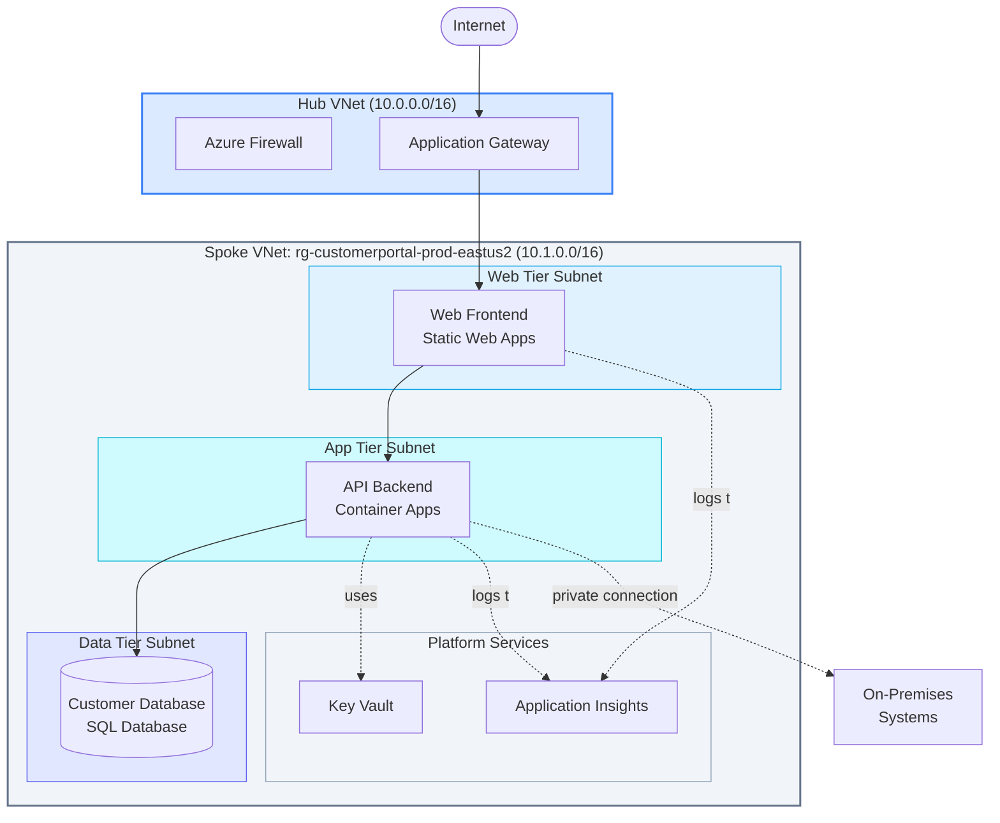

```mermaid
graph TB
    subgraph hub["Hub VNet (10.0.0.0/16)"]
        fw[Azure Firewall]
        appgw[Application Gateway]
    end

    subgraph spoke["Spoke VNet: rg-customerportal-prod-eastus2 (10.1.0.0/16)"]
        subgraph web_tier["Web Tier Subnet"]
            frontend[Web Frontend<br/>Static Web Apps]
        end
        
        subgraph app_tier["App Tier Subnet"]
            api[API Backend<br/>Container Apps]
        end
        
        subgraph data_tier["Data Tier Subnet"]
            sqldb[(Customer Database<br/>SQL Database)]
        end
        
        subgraph platform["Platform Services"]
            kv[Key Vault]
            monitor[Application Insights]
        end
    end

    internet([Internet]) --> appgw
    appgw --> frontend
    frontend --> api
    api --> sqldb
    
    api -.uses.-> kv
    api -.logs to.-> monitor
    frontend -.logs to.-> monitor
    
    api -.private connection.-> onprem[On-Premises<br/>Systems]
    
    style hub fill:#dbeafe,stroke:#3b82f6,stroke-width:2px
    style spoke fill:#f1f5f9,stroke:#64748b,stroke-width:2px
    style web_tier fill:#e0f2fe,stroke:#0ea5e9,stroke-width:1px
    style app_tier fill:#cffafe,stroke:#06b6d4,stroke-width:1px
    style data_tier fill:#e0e7ff,stroke:#6366f1,stroke-width:1px
    style platform fill:#f1f5f9,stroke:#94a3b8,stroke-width:1px
```
